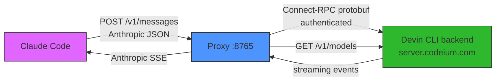

# cognition-claude-proxy

A local proxy that lets **Claude Code** (or any Anthropic-API client) use
**Devin's model catalog** — SWE-2, GLM-5.2, DeepSeek V4.1 Flash, and 200+
others — as its backend. It translates the Anthropic Messages API to the
Connect-RPC format that the Devin CLI uses, and translates the streaming
responses back to Anthropic SSE.

## How it works



<details>
<summary>Plain-text flow</summary>

```
claude  (ANTHROPIC_BASE_URL=http://localhost:8765)
  -> POST /v1/messages            (Anthropic Messages API, JSON)
    -> proxy: translate to Connect-RPC protobuf
      -> POST https://server.codeium.com  (authenticated via local Devin CLI credentials)
    <- Connect server-stream of events (text/thinking/tool-call/usage)
  <- Anthropic SSE events (message_start/content_block_*/message_delta)
```

</details>

The proxy authenticates using your local Devin CLI credentials
(`%APPDATA%\devin\credentials.toml` on Windows, `~/.config/devin/credentials.toml`
on Linux/macOS). No API keys to manage — if `devin` works, `dclaude` works.

## Prerequisites

- [Node.js](https://nodejs.org/) 18+
- [Devin CLI](https://devin.ai/) installed and authenticated (`devin` command works)
- [Claude Code](https://docs.anthropic.com/en/docs/claude-code) installed (`claude` command works)

## Quick start

```powershell
git clone https://github.com/coderexpert123/cognition-claude-proxy.git
cd cognition-claude-proxy

# Option A: use the wrapper (auto-starts the proxy)
bin\dclaude.bat -p "hello"

# Option B: start the proxy manually
node src/server.js            # starts on 127.0.0.1:8765
# then in another shell:
set ANTHROPIC_BASE_URL=http://localhost:8765
set ANTHROPIC_AUTH_TOKEN=test
claude -p "hello"
```

## Setup

```powershell
cd cognition-claude-proxy
node src/server.js            # starts on 127.0.0.1:8765
```

Then use the wrapper (put `bin\` on PATH or call directly):

```powershell
bin\dclaude.bat               # launches claude pointed at the proxy
bin\dclaude.bat --model swe-2 # pick any model from `devin models list`
bin\dclaude.bat --free        # free-models-only fallback (replaces paid models with free ones)
```

Env knobs: `CCP_PORT` (default 8765), `CCP_API_KEY` (override credential),
`CCP_CREDENTIALS` (override credentials.toml path), `CCP_UPSTREAM`
(override backend URL), `CCP_DEFAULT_MODEL` (default `swe-2-high`),
`CCP_DEBUG` (log requests + dump bodies to `%TEMP%\ccp-*.json`),
`CCP_DEBUG_SSE` (dump emitted SSE to `%TEMP%\ccp-*.log`).

## Model waterfall

`dclaude.bat` maps Claude Code's tier aliases to a pinned model waterfall:

| Tier | Alias | Model | Effort | Context |
|------|-------|-------|--------|---------|
| Orchestrate | fable | `glm-5-2` | high | 200K |
| Deep-plan | opus | `deepseek-v4-1-flash-max[1m]` | max | 1M |
| Execute | sonnet | `swe-2-max` | max | 262K |
| Background | haiku | `swe-2-medium` | medium | 262K |
| Verify | (explicit) | `glm-5-2` | high | 200K |

`--free` fallback: replaces the paid deep-plan model (deepseek) with
`glm-5-2`; sonnet/haiku stay on free SWE-2.

## Models & context windows

`GET /v1/models` live-syncs from the upstream model catalog — the same call
`devin models list` uses — returning every available model with its
`context_window` and `max_output_tokens`. If the fetch fails it falls back to
a bundled snapshot (`src/models.json`, 398 entries).

Claude Code decides context accounting client-side. The proxy configures
per-model context windows via a `claude-settings.json` file (passed through
`--settings`) containing `modelPicker` rows with `[1m]` suffixes for 1M-context
models and `behavesAs` entries for 200K models. Run
`node scripts/gen-settings.js` to regenerate it from `src/models.json`.

## Status

Verified end-to-end with real `claude -p` sessions: text + thinking deltas,
tool calls (streamed JSON args), tool results, usage stats, multi-turn agent
loops (SWE-2 called the `Write` tool through Claude Code and it executed).
MCP tools (Playwright, context7, etc.) work through the proxy.

Not yet handled: images (replaced with a text placeholder), prompt caching
(`cache_control` is stripped), `thinking.budget_tokens` mapping.

## Compatibility notes

- The upstream backend runs a pre-inference content filter. Claude Code's
  system prompt contains phrases that trip it, so the proxy replaces the
  system prompt with a neutral equivalent (`sanitizeSystem` in
  `src/translate.js`). Tool descriptions are also sanitized and capped at
  480 chars. If a request fails with `permission_denied: "content policy"`,
  check the proxy console log and extend the sanitizer.
- Cloud MCP connectors (Drive, Gmail, Calendar) are disabled by Claude Code
  when a custom `ANTHROPIC_AUTH_TOKEN` is set. Local/stdio MCPs work fine.
- `[1m]` is the only context suffix Claude Code recognizes — `[262k]` is not
  parsed and would be sent upstream as part of the model name.

## Troubleshooting

**`permission_denied: "content policy"`** — The upstream content filter
rejected something in the request. Check the proxy console log for the
upstream error. If Claude Code updated its system prompt with new phrases,
extend `sanitizeSystem` in `src/translate.js`.

**`permission_denied: "MCP configuration issue"`** — Misleading; this is
usually a tool description tripping the content filter, not an actual MCP
problem. Check which tool description triggered it and extend
`sanitizeToolDesc` in `src/translate.js`.

**Empty response from Claude Code** — The proxy is running but Claude Code
shows nothing. Ensure the proxy started successfully (check
`http://localhost:8765/health` returns `{"ok":true}`). If it did, run with
`CCP_DEBUG=1` to dump request/response bodies to `%TEMP%\ccp-*.json`.

**`windsurf_api_key not found`** — The proxy couldn't find your Devin CLI
credentials. Ensure `devin` works first. Or set `CCP_API_KEY` directly.

**Model not found / wrong context window** — Run `node scripts/gen-settings.js`
to regenerate `claude-settings.json` from the latest `src/models.json` snapshot.
To refresh the snapshot, capture a live `GetCliModelConfigs` response and
decode it (see `src/models.js` for the field mapping).

**Proxy port already in use** — Set `CCP_PORT=8766` (or any free port) before
starting the proxy. If using `dclaude.bat`, set it in the environment before
running the wrapper.

**Upstream API changed** — If the backend protocol changes, the proxy will
break. The field mappings are in `src/codeium.js` (request encoding) and
`src/translate.js` (response decoding). Check the proxy console log for
decode errors. PRs welcome.

## Verify your setup

```powershell
node scripts/test.js    # checks /health and /v1/models
```
